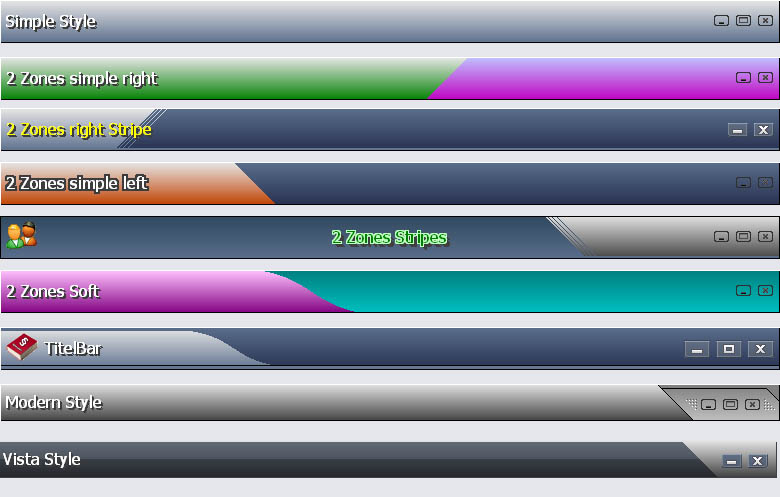

## TitelBar V4\.00 Update

### Description

This Titelbar ist a complete Replacement for the normal and boring Windows Titelbar.

It act like the original, you can handle and Move, you can Minimize and Close it like the real one.

Simple put it on your Form (Borderstyle of your Form should be 0).

You can change the look by 4 Gradient Color Style, also for two Zones.

There 12 Different Styles (like on the Screenshot).

Your can also add Icons, you can Change the Sytle of your Caption (Color, Shadow, Border etc.)

This time there are 3 Types of Buttons (Close, Minimize, Maximized), you can put your own Icons in the Control as well.

Feel free to Comment and to use it for your Projects.

Update 16.10.2009 - V4.00

Changed the Style Information into english (I tried :)

Added the Maximized Button and Function (as Windows)

Regards J.Pfeffer alias Peppa
 
### More Info
 

             |
---                |---
**Submitted On**   |2009-10-15 20:54:24
**By**             |[J\.Pfeffer](https://github.com/Planet-Source-Code/PSCIndex/blob/master/ByAuthor/j-pfeffer.md)
**Level**          |Advanced
**User Rating**    |5.0 (99 globes from 20 users)
**Compatibility**  |VB 6\.0
**Category**       |[Custom Controls/ Forms/  Menus](https://github.com/Planet-Source-Code/PSCIndex/blob/master/ByCategory/custom-controls-forms-menus__1-4.md)
**World**          |[Visual Basic](https://github.com/Planet-Source-Code/PSCIndex/blob/master/ByWorld/visual-basic.md)
**Archive File**   |[TitelBar\_V21653110162009\.zip](https://github.com/Planet-Source-Code/j-pfeffer-titelbar-v4-00-update__1-72538/archive/master.zip)

